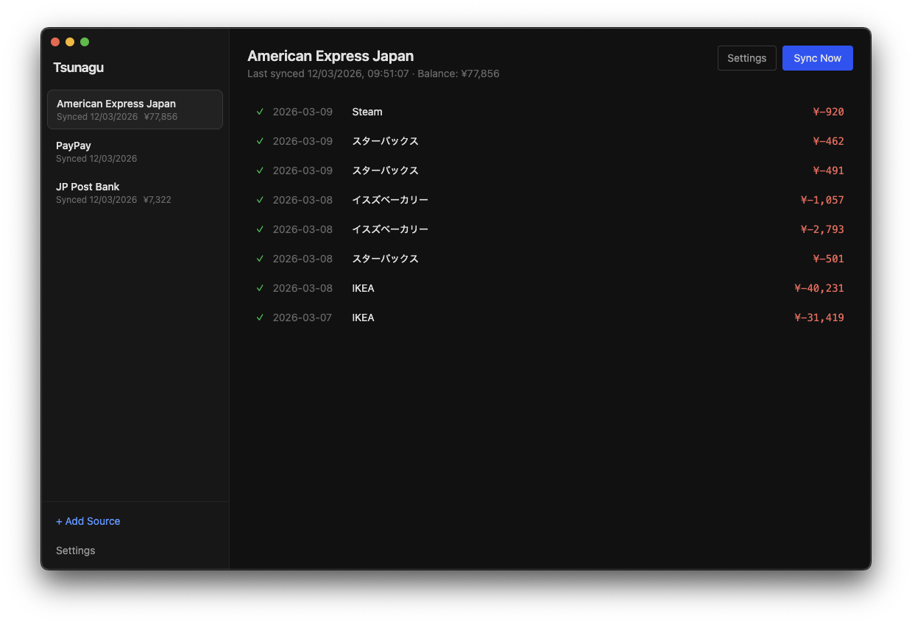

# Tsunagu

A small Electron app designed to interactively scrape transactions from Japanese financial sources and push them to Pocketsmith (which has no native support for Japan)

Uses a local sqlite database for storage. Asks for passwords every time during auth and does not store them.

Built using Claude Code (Opus 4.6). See `docs/superpowers` for plans and specs.



## Sources

### Amex Japan

Interactively signs in (stores username; prompts for password). Waits for 2FA prompt.

### Yuchō Ginkō

Interactively signs in (stores username; prompts for password)

### PayPay

Reads PayPay transaction exports from a configured directory and imports them.

### SBI Shinsei

Under development

## Development

To install dependencies:

```bash
bun install
```

To run:

```bash
bun run dev
```
